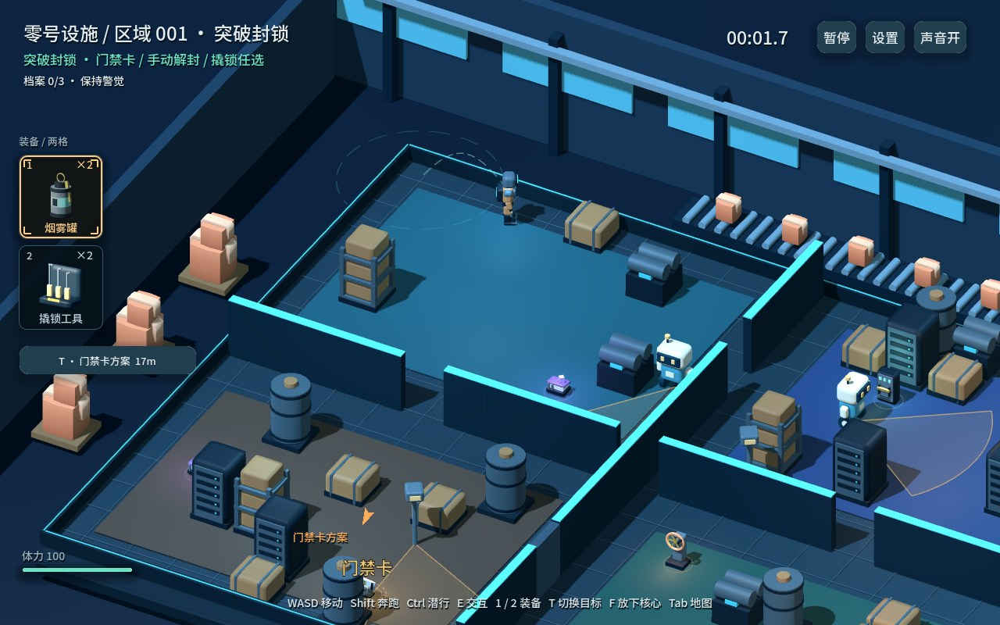
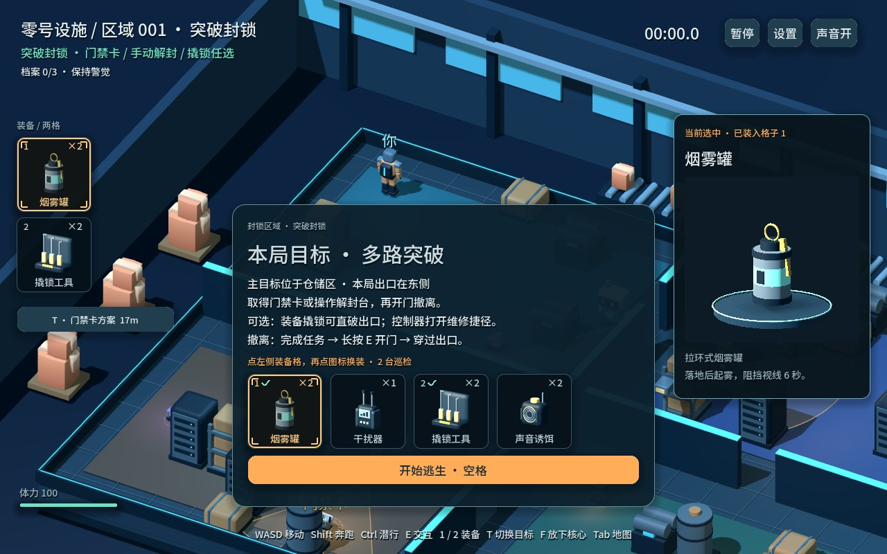
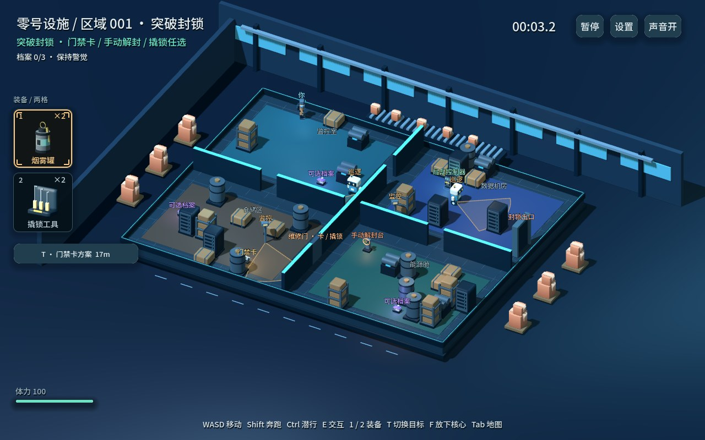
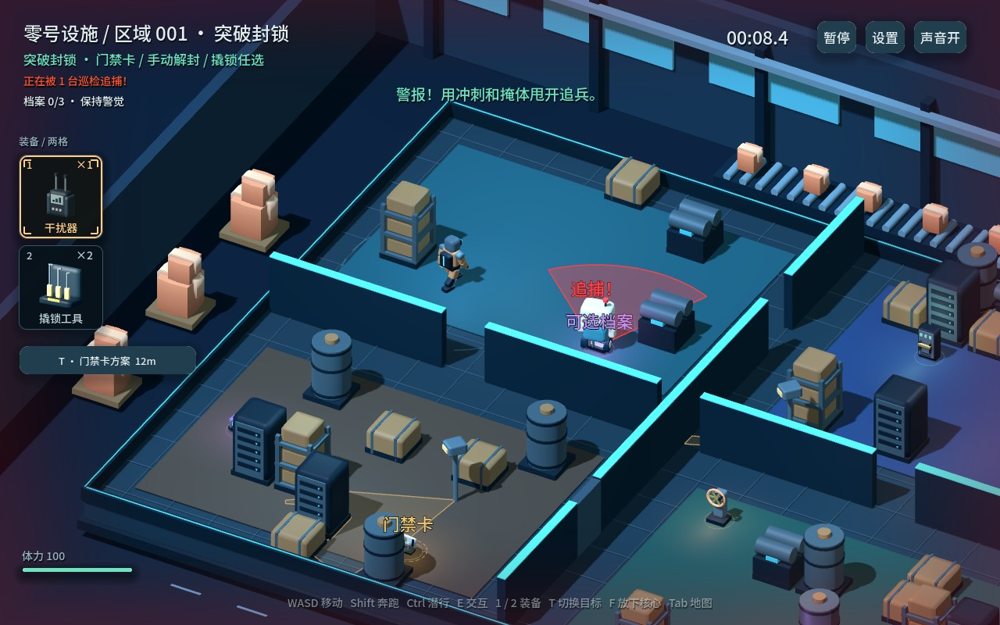

# 零号设施 · 潜行逃生

**在封锁的科幻设施里，用两件装备，规划不止一条逃生路线。**

基于 **Godot 4.7.2 / GDScript / Compatibility** 的中文 3D 战术潜行游戏原型。直接操控维修员，在巡逻机器人、监控和分区门禁之间完成任务，然后真正穿过出口。

### [▶ 在线游玩 · GitHub Pages](https://suyancc.github.io/zero-facility/)

[](https://github.com/suyancc/zero-facility/actions/workflows/pages.yml)

> 当前版本 **0.6.7 · 开发原型**。推荐桌面版 Chrome / Edge 和键盘鼠标，需要 WebGL 2.0。首次加载需要下载约 40 MB 引擎文件，实际传输量取决于 CDN 压缩；请等待载入并点击游戏解锁声音。移动端与触屏尚未适配。
>
> **已知性能问题：** 音乐／环境音播放已被测得会明显增加帧耗时，检测和追捕时可能卡顿；音频性能修复尚未完成。请不要把当前版本视为已完成性能优化的正式发行版。



## 游戏截图

### 两格装备，提前选择方案

烟雾罐、干扰器、撬锁工具和声音诱饵中选择两种。背包保留数量、快捷键与冷却；准备界面可查看对应的 3D 模型。



### 观察地图，绕开封锁

按住 Tab 俯瞰设施。掩体会遮挡视线，维修门与控制器能打开捷径；不同任务与区域有不同目标和出口。



### 被发现，不代表立刻失败

机器人会经历确认、追捕、搜索和返回巡逻。断开视线、合理使用装备，可以争取再次脱身。



*前三张截图来自本次 0.6.7 Web 构建；追捕截图来自 0.6.6 实机测试，0.6.7 主要调整音频。所有图片均为游戏实际渲染，并非概念图。*

## 玩法亮点

- **直接控制人物**：步行、冲刺、潜行，独立四肢与搬运姿态。
- **多方案潜入**：门禁卡、手动解封、撬锁；任务不强制消耗道具。
- **三类基础任务、九种配置**：突破封锁、盗取数据、能源转移，以及分段取证、双端校验等变体。
- **可重复挑战的区域**：按区域种子生成布局，后续区域持续轮换；同关重试保持地图与任务配置。
- **有遮挡的追捕**：巡逻机器人与监控、声音调查、最后位置搜索；烟雾不能消除脚步声或近身抓捕。
- **情境反馈**：红色视野、边缘心跳、分层背景音乐，以及交互过程、任务完成和装备的不同音效。
- **本地进度**：浏览器本地保存进度与设置，不需要账号；清除站点数据会清除本地记录。本地地址与 Pages 地址的存档互不共享。

## 操作

| 按键 | 功能 |
|---|---|
| WASD / 方向键 | 移动 |
| Shift / Ctrl | 冲刺 / 潜行 |
| 长按 E | 交互、下载、解锁或交付 |
| 1 / 2 | 使用对应槽位装备 |
| 鼠标指向 | 确定投掷目标，查看轨迹与范围 |
| Q / 鼠标右键 | 使用已装备的声音诱饵，与槽位共享数量 |
| T | 切换任务方案或支线指引 |
| F | 放下搬运中的核心 |
| 按住 Tab | 俯瞰地图 |
| Esc / R / M | 暂停 / 同关重试 / 静音 |
| 空格 | 开始本局 |

撬锁先按装备键准备，再长按 E。所有任务最终都需要完成门禁操作并穿过出口。

## 本地开发

```bash
git clone https://github.com/suyancc/zero-facility.git
cd zero-facility
```

使用 Godot **4.7.2** 导入根目录 `project.godot`，按 F5 运行。发布仓库不依赖编辑器 MCP 插件，也不包含开发机器的凭据或存档。内部应用名保留旧名称以兼容原有存档，对外显示为“零号设施”。

### 直接运行已导出的 Web 版本

```bash
python -m http.server 8000 --directory web
```

打开 `http://localhost:8000/`。不要直接双击 `index.html`，浏览器需要通过 HTTP/HTTPS 加载 Wasm 与资源。

### 重新导出并发布

安装对应 Godot Web 导出模板；Windows 使用 PowerShell 7，并安装 Python 3。

```powershell
./tools/build-web.ps1 -GodotPath "C:/path/to/Godot_console.exe"
python tools/verify_web_release.py --stage
python tools/verify_web_release.py
git add .
git commit -m "Update game and Web export"
git push origin main
```

`build-web.ps1` 在隔离目录导出到 `exports/web`；`--stage` 将导出文件整理到 `web/` 并记录源码与资源 SHA-256。请先检查导出日志没有 `SCRIPT ERROR`，并实际运行导出页面，再执行 `--stage`；它不是编译器或源码一致性的替代品。

**GitHub Actions 部署仓库中已导出的 `web/`，不会自动安装 Godot 或重新导出。** 流水线会校验运行源码指纹和 Web 文件哈希；改了源码但忘记更新导出时会失败，避免静默发布旧版本。GitHub Pages 的 Source 应设为 **GitHub Actions**。

Web 使用单线程导出，未启用线程扩展或 PWA；不依赖 Pages 不支持的自定义 COOP/COEP 响应头。

## 验证与已知问题

```powershell
& "C:/path/to/Godot_console.exe" --headless --path . --fixed-fps 60 --quit-after 1800 --script res://tests/run_tests.gd
& "C:/path/to/Godot_console.exe" --headless --path . --fixed-fps 60 --quit-after 1800 --script res://tests/v5_tests.gd
```

0.6.7 既有检查记录为 **186 项功能检查 + 49 项旧机制回归**。必须同时检查日志中的显式结果与脚本错误，不能仅凭退出码判断通过。功能检查通过不代表所有浏览器运行流畅。

- **音频卡顿未修复**：独立 Chrome、四台机器人扫描对照中，停止全部音频约 23–25ms/帧，恢复音频约 39–41ms/帧。此为特定机器与受控场景结果，不是所有设备的性能承诺。
- 静音或音量设为零不等于停止解码播放，不能保证通过静音解决卡顿。
- 用户报告过检测后整页无响应；目前复现了明显卡顿，但尚未锁定永久无响应根因。
- 原生测试退出时仍有 16 个 ObjectDB / 8 个资源警告，尚未解决。
- 当前不是完整的移动端游戏，不保证所有显卡、浏览器和高 DPI 配置达到流畅帧率。

详细记录：[音频性能对照](docs/0.6.7-音频卡顿对照.md) · [多机器人扫描排查](docs/0.6.7-多机器人扫描排查.md) · [版本与开发记录](docs/开发与版本记录.md)

## 项目结构

```text
scenes/       人物、物品与主场景
scripts/      移动、巡逻、任务、UI、音频与地图生成
assets/       模型、字体、图片、音效与第三方许可证
tests/        功能、路线与独立浏览器诊断脚本
tools/        导出、资源生成与 Web 发布校验
docs/         设计、验证记录与实机截图
web/          可直接部署的 Web 导出
.github/      GitHub Pages 部署流程
```

## 素材与许可

部分工业场景素材与音效来自 **Kenney（CC0）**；中文字体使用 **Noto Sans SC 的改名字体子集（SIL OFL）**。人物、装备组合几何与多种合成音效的来源详见 [素材来源与许可](docs/素材来源与许可.md)，许可证保留于 `assets/licenses/`，Web 导出也附带相应说明。

**项目原创源码目前未指定开源许可证。** 公开仓库不代表原创内容自动获得 MIT 等授权；第三方素材分别遵循其自身许可证。

